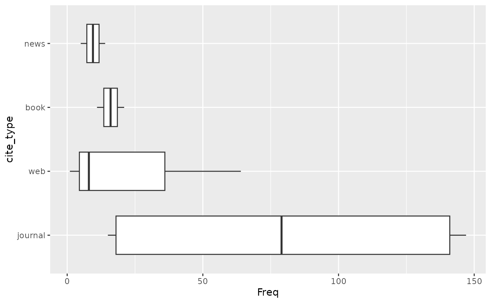
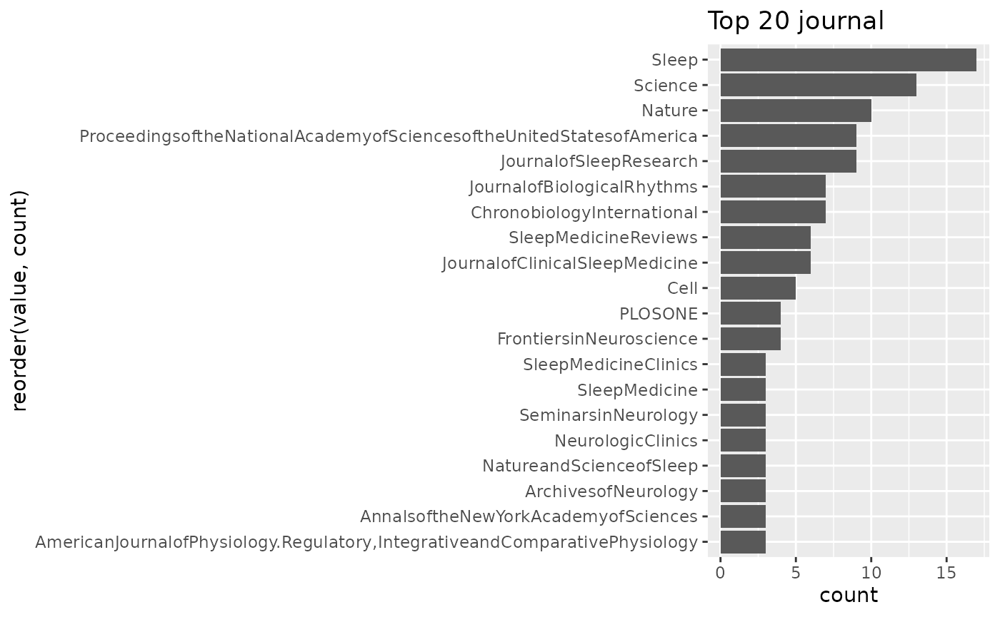
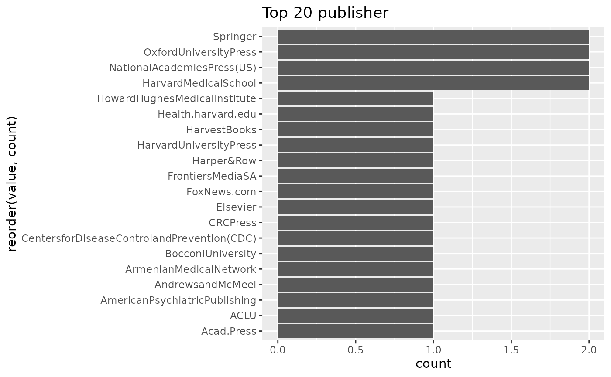
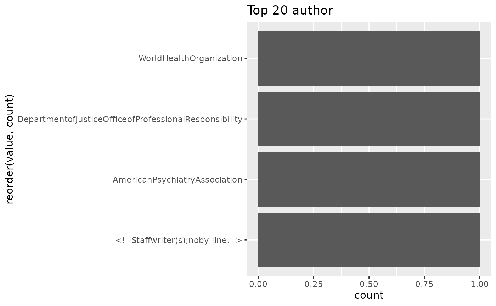

# Citation Analysis with wikilite

## Introduction

This vignette demonstrates how to extract, count, parse, and visualise
citations from Wikipedia articles using **wikilite**. We will work with
a small set of articles about sleep science to illustrate each step.

## Fetch article data

``` r

library(wikilite)

articles <- c("Zeitgeber",
              "Advanced sleep phase disorder",
              "Sleep deprivation",
              "Circadian rhythm")

# Most recent revision of each article
recent <- get_category_articles_most_recent(articles)
```

## Count citations using built-in patterns

The package stores all built-in regular expressions in the `pkg.env`
environment. You can inspect them:

``` r

names(pkg.env$regexp_list)
#>  [1] "doi_regexp"           "isbn_regexp"          "url_regexp"          
#>  [4] "wikihyperlink_regexp" "tweet_regexp"         "news_regexp"         
#>  [7] "magazine_regexp"      "journal_regexp"       "web_regexp"          
#> [10] "article_regexp"       "report_regexp"        "press_release_regexp"
#> [13] "court_regexp"         "patent_regexp"        "conference_regexp"   
#> [16] "thesis_regexp"        "arxiv_regexp"         "encyclopedia_regexp" 
#> [19] "av_media_regexp"      "episode_regexp"       "podcast_regexp"      
#> [22] "book_regexp"          "pmid_regexp"          "ref_in_text_regexp"  
#> [25] "ref_regexp"           "cite_regexp"          "template_regexp"
```

Apply a single pattern:

``` r

doi_regexp <- pkg.env$doi_regexp
dois <- get_regex_citations_in_wiki_table(recent, doi_regexp)
head(dois)
#>         art      revid                     citation_fetched
#> 1 Zeitgeber 1330736183 10.1001/archpsyc.1988.01800340076012
#> 2 Zeitgeber 1330736183            10.1016/j.cpr.2006.07.001
#> 3 Zeitgeber 1330736183            10.1016/j.cub.2006.12.011
#> 4 Zeitgeber 1330736183         10.1016/0031-9384(92)90188-8
#> 5 Zeitgeber 1330736183  10.47102/annals-acadmedsg.V37N8p662
#> 6 Zeitgeber 1330736183           10.1016/j.tics.2010.03.007
```

Apply every pattern at once and receive a named list:

``` r

all_results <- extract_citations_regexp(recent)

# Each element is a data frame with art, revid, citation_fetched
sapply(all_results, nrow)
#>           doi_regexp          isbn_regexp           url_regexp 
#>                  312                   52                  197 
#> wikihyperlink_regexp         tweet_regexp          news_regexp 
#>                  600                    0                   19 
#>      magazine_regexp       journal_regexp           web_regexp 
#>                    0                  318                   73 
#>       article_regexp        report_regexp press_release_regexp 
#>                    0                    1                    1 
#>         court_regexp        patent_regexp    conference_regexp 
#>                    0                    0                    1 
#>        thesis_regexp         arxiv_regexp  encyclopedia_regexp 
#>                    0                    0                    0 
#>      av_media_regexp       episode_regexp       podcast_regexp 
#>                    0                    0                    0 
#>          book_regexp          pmid_regexp   ref_in_text_regexp 
#>                   32                  594                  299 
#>           ref_regexp          cite_regexp      template_regexp 
#>                  442                  445                    0
```

## Count individual elements per article

``` r

results <- lapply(seq_len(nrow(recent)), function(i) {
  text <- recent$`*`[i]
  data.frame(
    art          = recent$art[i],
    n_doi        = get_doi_count(text),
    n_isbn       = get_ISBN_count(text),
    n_url        = get_urlCount(text),
    n_ref        = get_refCount(text),
    n_hyperlinks = get_hyperlinkCount(text),
    sci_score    = get_sci_score(text)
  )
})

count_table <- do.call(rbind, results)
count_table
#>                             art n_doi n_isbn n_url n_ref n_hyperlinks sci_score
#> 1                     Zeitgeber    13      0     3    16           33 1.0000000
#> 2 Advanced sleep phase disorder    19      0     3    20           52 0.9500000
#> 3             Sleep deprivation   136     40   150   241          245 0.5756303
#> 4              Circadian rhythm   144     12    41   165          270 0.8546512
```

## Parse Citation Style 1 templates

[`parse_article_ALL_citations()`](https://jsobel1.github.io/wikilite/reference/parse_article_ALL_citations.md)
splits every CS1 template into a tidy long data frame where each row is
one field:

``` r

# For a single article
zeitgeber_recent <- recent[recent$art == "Zeitgeber", ]
parsed_one <- parse_article_ALL_citations(zeitgeber_recent$`*`)
head(parsed_one)
#>                                                                                                                                                                                                                                                                                  type
#>  journal |doi=10.1001/archpsyc.1988.01800340076012|title=Social Zeitgebers and Biological Rhythms|year=1988|last1=Ehlers|first1=Cindy L.|last2=Frank|first2=E.|last3=Kupfer|first3=D. J.|journal=Archives of General Psychiatry|volume=45|issue=10|pages=948–52|pmid=30482261 journal
#>  journal |doi=10.1001/archpsyc.1988.01800340076012|title=Social Zeitgebers and Biological Rhythms|year=1988|last1=Ehlers|first1=Cindy L.|last2=Frank|first2=E.|last3=Kupfer|first3=D. J.|journal=Archives of General Psychiatry|volume=45|issue=10|pages=948–52|pmid=30482262 journal
#>  journal |doi=10.1001/archpsyc.1988.01800340076012|title=Social Zeitgebers and Biological Rhythms|year=1988|last1=Ehlers|first1=Cindy L.|last2=Frank|first2=E.|last3=Kupfer|first3=D. J.|journal=Archives of General Psychiatry|volume=45|issue=10|pages=948–52|pmid=30482263 journal
#>  journal |doi=10.1001/archpsyc.1988.01800340076012|title=Social Zeitgebers and Biological Rhythms|year=1988|last1=Ehlers|first1=Cindy L.|last2=Frank|first2=E.|last3=Kupfer|first3=D. J.|journal=Archives of General Psychiatry|volume=45|issue=10|pages=948–52|pmid=30482264 journal
#>  journal |doi=10.1001/archpsyc.1988.01800340076012|title=Social Zeitgebers and Biological Rhythms|year=1988|last1=Ehlers|first1=Cindy L.|last2=Frank|first2=E.|last3=Kupfer|first3=D. J.|journal=Archives of General Psychiatry|volume=45|issue=10|pages=948–52|pmid=30482265 journal
#>  journal |doi=10.1001/archpsyc.1988.01800340076012|title=Social Zeitgebers and Biological Rhythms|year=1988|last1=Ehlers|first1=Cindy L.|last2=Frank|first2=E.|last3=Kupfer|first3=D. J.|journal=Archives of General Psychiatry|volume=45|issue=10|pages=948–52|pmid=30482266 journal
#>                                                                                                                                                                                                                                                                               id_cite
#>  journal |doi=10.1001/archpsyc.1988.01800340076012|title=Social Zeitgebers and Biological Rhythms|year=1988|last1=Ehlers|first1=Cindy L.|last2=Frank|first2=E.|last3=Kupfer|first3=D. J.|journal=Archives of General Psychiatry|volume=45|issue=10|pages=948–52|pmid=30482261       1
#>  journal |doi=10.1001/archpsyc.1988.01800340076012|title=Social Zeitgebers and Biological Rhythms|year=1988|last1=Ehlers|first1=Cindy L.|last2=Frank|first2=E.|last3=Kupfer|first3=D. J.|journal=Archives of General Psychiatry|volume=45|issue=10|pages=948–52|pmid=30482262       1
#>  journal |doi=10.1001/archpsyc.1988.01800340076012|title=Social Zeitgebers and Biological Rhythms|year=1988|last1=Ehlers|first1=Cindy L.|last2=Frank|first2=E.|last3=Kupfer|first3=D. J.|journal=Archives of General Psychiatry|volume=45|issue=10|pages=948–52|pmid=30482263       1
#>  journal |doi=10.1001/archpsyc.1988.01800340076012|title=Social Zeitgebers and Biological Rhythms|year=1988|last1=Ehlers|first1=Cindy L.|last2=Frank|first2=E.|last3=Kupfer|first3=D. J.|journal=Archives of General Psychiatry|volume=45|issue=10|pages=948–52|pmid=30482264       1
#>  journal |doi=10.1001/archpsyc.1988.01800340076012|title=Social Zeitgebers and Biological Rhythms|year=1988|last1=Ehlers|first1=Cindy L.|last2=Frank|first2=E.|last3=Kupfer|first3=D. J.|journal=Archives of General Psychiatry|volume=45|issue=10|pages=948–52|pmid=30482265       1
#>  journal |doi=10.1001/archpsyc.1988.01800340076012|title=Social Zeitgebers and Biological Rhythms|year=1988|last1=Ehlers|first1=Cindy L.|last2=Frank|first2=E.|last3=Kupfer|first3=D. J.|journal=Archives of General Psychiatry|volume=45|issue=10|pages=948–52|pmid=30482266       1
#>                                                                                                                                                                                                                                                                               variable
#>  journal |doi=10.1001/archpsyc.1988.01800340076012|title=Social Zeitgebers and Biological Rhythms|year=1988|last1=Ehlers|first1=Cindy L.|last2=Frank|first2=E.|last3=Kupfer|first3=D. J.|journal=Archives of General Psychiatry|volume=45|issue=10|pages=948–52|pmid=30482261      doi
#>  journal |doi=10.1001/archpsyc.1988.01800340076012|title=Social Zeitgebers and Biological Rhythms|year=1988|last1=Ehlers|first1=Cindy L.|last2=Frank|first2=E.|last3=Kupfer|first3=D. J.|journal=Archives of General Psychiatry|volume=45|issue=10|pages=948–52|pmid=30482262    title
#>  journal |doi=10.1001/archpsyc.1988.01800340076012|title=Social Zeitgebers and Biological Rhythms|year=1988|last1=Ehlers|first1=Cindy L.|last2=Frank|first2=E.|last3=Kupfer|first3=D. J.|journal=Archives of General Psychiatry|volume=45|issue=10|pages=948–52|pmid=30482263     year
#>  journal |doi=10.1001/archpsyc.1988.01800340076012|title=Social Zeitgebers and Biological Rhythms|year=1988|last1=Ehlers|first1=Cindy L.|last2=Frank|first2=E.|last3=Kupfer|first3=D. J.|journal=Archives of General Psychiatry|volume=45|issue=10|pages=948–52|pmid=30482264    last1
#>  journal |doi=10.1001/archpsyc.1988.01800340076012|title=Social Zeitgebers and Biological Rhythms|year=1988|last1=Ehlers|first1=Cindy L.|last2=Frank|first2=E.|last3=Kupfer|first3=D. J.|journal=Archives of General Psychiatry|volume=45|issue=10|pages=948–52|pmid=30482265   first1
#>  journal |doi=10.1001/archpsyc.1988.01800340076012|title=Social Zeitgebers and Biological Rhythms|year=1988|last1=Ehlers|first1=Cindy L.|last2=Frank|first2=E.|last3=Kupfer|first3=D. J.|journal=Archives of General Psychiatry|volume=45|issue=10|pages=948–52|pmid=30482266    last2
#>                                                                                                                                                                                                                                                                                                                  value
#>  journal |doi=10.1001/archpsyc.1988.01800340076012|title=Social Zeitgebers and Biological Rhythms|year=1988|last1=Ehlers|first1=Cindy L.|last2=Frank|first2=E.|last3=Kupfer|first3=D. J.|journal=Archives of General Psychiatry|volume=45|issue=10|pages=948–52|pmid=30482261     10.1001/archpsyc.1988.01800340076012
#>  journal |doi=10.1001/archpsyc.1988.01800340076012|title=Social Zeitgebers and Biological Rhythms|year=1988|last1=Ehlers|first1=Cindy L.|last2=Frank|first2=E.|last3=Kupfer|first3=D. J.|journal=Archives of General Psychiatry|volume=45|issue=10|pages=948–52|pmid=30482262 Social Zeitgebers and Biological Rhythms
#>  journal |doi=10.1001/archpsyc.1988.01800340076012|title=Social Zeitgebers and Biological Rhythms|year=1988|last1=Ehlers|first1=Cindy L.|last2=Frank|first2=E.|last3=Kupfer|first3=D. J.|journal=Archives of General Psychiatry|volume=45|issue=10|pages=948–52|pmid=30482263                                     1988
#>  journal |doi=10.1001/archpsyc.1988.01800340076012|title=Social Zeitgebers and Biological Rhythms|year=1988|last1=Ehlers|first1=Cindy L.|last2=Frank|first2=E.|last3=Kupfer|first3=D. J.|journal=Archives of General Psychiatry|volume=45|issue=10|pages=948–52|pmid=30482264                                   Ehlers
#>  journal |doi=10.1001/archpsyc.1988.01800340076012|title=Social Zeitgebers and Biological Rhythms|year=1988|last1=Ehlers|first1=Cindy L.|last2=Frank|first2=E.|last3=Kupfer|first3=D. J.|journal=Archives of General Psychiatry|volume=45|issue=10|pages=948–52|pmid=30482265                                 Cindy L.
#>  journal |doi=10.1001/archpsyc.1988.01800340076012|title=Social Zeitgebers and Biological Rhythms|year=1988|last1=Ehlers|first1=Cindy L.|last2=Frank|first2=E.|last3=Kupfer|first3=D. J.|journal=Archives of General Psychiatry|volume=45|issue=10|pages=948–52|pmid=30482266                                    Frank
```

Parse all articles at once:

``` r

parsed <- get_parsed_citations(recent)
# Columns: art, revid, type, id_cite, variable, value
head(parsed)
#>                                                                                                                                                                                                                                                                                     art
#>  journal |doi=10.1001/archpsyc.1988.01800340076012|title=Social Zeitgebers and Biological Rhythms|year=1988|last1=Ehlers|first1=Cindy L.|last2=Frank|first2=E.|last3=Kupfer|first3=D. J.|journal=Archives of General Psychiatry|volume=45|issue=10|pages=948–52|pmid=30482261 Zeitgeber
#>  journal |doi=10.1001/archpsyc.1988.01800340076012|title=Social Zeitgebers and Biological Rhythms|year=1988|last1=Ehlers|first1=Cindy L.|last2=Frank|first2=E.|last3=Kupfer|first3=D. J.|journal=Archives of General Psychiatry|volume=45|issue=10|pages=948–52|pmid=30482262 Zeitgeber
#>  journal |doi=10.1001/archpsyc.1988.01800340076012|title=Social Zeitgebers and Biological Rhythms|year=1988|last1=Ehlers|first1=Cindy L.|last2=Frank|first2=E.|last3=Kupfer|first3=D. J.|journal=Archives of General Psychiatry|volume=45|issue=10|pages=948–52|pmid=30482263 Zeitgeber
#>  journal |doi=10.1001/archpsyc.1988.01800340076012|title=Social Zeitgebers and Biological Rhythms|year=1988|last1=Ehlers|first1=Cindy L.|last2=Frank|first2=E.|last3=Kupfer|first3=D. J.|journal=Archives of General Psychiatry|volume=45|issue=10|pages=948–52|pmid=30482264 Zeitgeber
#>  journal |doi=10.1001/archpsyc.1988.01800340076012|title=Social Zeitgebers and Biological Rhythms|year=1988|last1=Ehlers|first1=Cindy L.|last2=Frank|first2=E.|last3=Kupfer|first3=D. J.|journal=Archives of General Psychiatry|volume=45|issue=10|pages=948–52|pmid=30482265 Zeitgeber
#>  journal |doi=10.1001/archpsyc.1988.01800340076012|title=Social Zeitgebers and Biological Rhythms|year=1988|last1=Ehlers|first1=Cindy L.|last2=Frank|first2=E.|last3=Kupfer|first3=D. J.|journal=Archives of General Psychiatry|volume=45|issue=10|pages=948–52|pmid=30482266 Zeitgeber
#>                                                                                                                                                                                                                                                                                    revid
#>  journal |doi=10.1001/archpsyc.1988.01800340076012|title=Social Zeitgebers and Biological Rhythms|year=1988|last1=Ehlers|first1=Cindy L.|last2=Frank|first2=E.|last3=Kupfer|first3=D. J.|journal=Archives of General Psychiatry|volume=45|issue=10|pages=948–52|pmid=30482261 1330736183
#>  journal |doi=10.1001/archpsyc.1988.01800340076012|title=Social Zeitgebers and Biological Rhythms|year=1988|last1=Ehlers|first1=Cindy L.|last2=Frank|first2=E.|last3=Kupfer|first3=D. J.|journal=Archives of General Psychiatry|volume=45|issue=10|pages=948–52|pmid=30482262 1330736183
#>  journal |doi=10.1001/archpsyc.1988.01800340076012|title=Social Zeitgebers and Biological Rhythms|year=1988|last1=Ehlers|first1=Cindy L.|last2=Frank|first2=E.|last3=Kupfer|first3=D. J.|journal=Archives of General Psychiatry|volume=45|issue=10|pages=948–52|pmid=30482263 1330736183
#>  journal |doi=10.1001/archpsyc.1988.01800340076012|title=Social Zeitgebers and Biological Rhythms|year=1988|last1=Ehlers|first1=Cindy L.|last2=Frank|first2=E.|last3=Kupfer|first3=D. J.|journal=Archives of General Psychiatry|volume=45|issue=10|pages=948–52|pmid=30482264 1330736183
#>  journal |doi=10.1001/archpsyc.1988.01800340076012|title=Social Zeitgebers and Biological Rhythms|year=1988|last1=Ehlers|first1=Cindy L.|last2=Frank|first2=E.|last3=Kupfer|first3=D. J.|journal=Archives of General Psychiatry|volume=45|issue=10|pages=948–52|pmid=30482265 1330736183
#>  journal |doi=10.1001/archpsyc.1988.01800340076012|title=Social Zeitgebers and Biological Rhythms|year=1988|last1=Ehlers|first1=Cindy L.|last2=Frank|first2=E.|last3=Kupfer|first3=D. J.|journal=Archives of General Psychiatry|volume=45|issue=10|pages=948–52|pmid=30482266 1330736183
#>                                                                                                                                                                                                                                                                                  type
#>  journal |doi=10.1001/archpsyc.1988.01800340076012|title=Social Zeitgebers and Biological Rhythms|year=1988|last1=Ehlers|first1=Cindy L.|last2=Frank|first2=E.|last3=Kupfer|first3=D. J.|journal=Archives of General Psychiatry|volume=45|issue=10|pages=948–52|pmid=30482261 journal
#>  journal |doi=10.1001/archpsyc.1988.01800340076012|title=Social Zeitgebers and Biological Rhythms|year=1988|last1=Ehlers|first1=Cindy L.|last2=Frank|first2=E.|last3=Kupfer|first3=D. J.|journal=Archives of General Psychiatry|volume=45|issue=10|pages=948–52|pmid=30482262 journal
#>  journal |doi=10.1001/archpsyc.1988.01800340076012|title=Social Zeitgebers and Biological Rhythms|year=1988|last1=Ehlers|first1=Cindy L.|last2=Frank|first2=E.|last3=Kupfer|first3=D. J.|journal=Archives of General Psychiatry|volume=45|issue=10|pages=948–52|pmid=30482263 journal
#>  journal |doi=10.1001/archpsyc.1988.01800340076012|title=Social Zeitgebers and Biological Rhythms|year=1988|last1=Ehlers|first1=Cindy L.|last2=Frank|first2=E.|last3=Kupfer|first3=D. J.|journal=Archives of General Psychiatry|volume=45|issue=10|pages=948–52|pmid=30482264 journal
#>  journal |doi=10.1001/archpsyc.1988.01800340076012|title=Social Zeitgebers and Biological Rhythms|year=1988|last1=Ehlers|first1=Cindy L.|last2=Frank|first2=E.|last3=Kupfer|first3=D. J.|journal=Archives of General Psychiatry|volume=45|issue=10|pages=948–52|pmid=30482265 journal
#>  journal |doi=10.1001/archpsyc.1988.01800340076012|title=Social Zeitgebers and Biological Rhythms|year=1988|last1=Ehlers|first1=Cindy L.|last2=Frank|first2=E.|last3=Kupfer|first3=D. J.|journal=Archives of General Psychiatry|volume=45|issue=10|pages=948–52|pmid=30482266 journal
#>                                                                                                                                                                                                                                                                               id_cite
#>  journal |doi=10.1001/archpsyc.1988.01800340076012|title=Social Zeitgebers and Biological Rhythms|year=1988|last1=Ehlers|first1=Cindy L.|last2=Frank|first2=E.|last3=Kupfer|first3=D. J.|journal=Archives of General Psychiatry|volume=45|issue=10|pages=948–52|pmid=30482261       1
#>  journal |doi=10.1001/archpsyc.1988.01800340076012|title=Social Zeitgebers and Biological Rhythms|year=1988|last1=Ehlers|first1=Cindy L.|last2=Frank|first2=E.|last3=Kupfer|first3=D. J.|journal=Archives of General Psychiatry|volume=45|issue=10|pages=948–52|pmid=30482262       1
#>  journal |doi=10.1001/archpsyc.1988.01800340076012|title=Social Zeitgebers and Biological Rhythms|year=1988|last1=Ehlers|first1=Cindy L.|last2=Frank|first2=E.|last3=Kupfer|first3=D. J.|journal=Archives of General Psychiatry|volume=45|issue=10|pages=948–52|pmid=30482263       1
#>  journal |doi=10.1001/archpsyc.1988.01800340076012|title=Social Zeitgebers and Biological Rhythms|year=1988|last1=Ehlers|first1=Cindy L.|last2=Frank|first2=E.|last3=Kupfer|first3=D. J.|journal=Archives of General Psychiatry|volume=45|issue=10|pages=948–52|pmid=30482264       1
#>  journal |doi=10.1001/archpsyc.1988.01800340076012|title=Social Zeitgebers and Biological Rhythms|year=1988|last1=Ehlers|first1=Cindy L.|last2=Frank|first2=E.|last3=Kupfer|first3=D. J.|journal=Archives of General Psychiatry|volume=45|issue=10|pages=948–52|pmid=30482265       1
#>  journal |doi=10.1001/archpsyc.1988.01800340076012|title=Social Zeitgebers and Biological Rhythms|year=1988|last1=Ehlers|first1=Cindy L.|last2=Frank|first2=E.|last3=Kupfer|first3=D. J.|journal=Archives of General Psychiatry|volume=45|issue=10|pages=948–52|pmid=30482266       1
#>                                                                                                                                                                                                                                                                               variable
#>  journal |doi=10.1001/archpsyc.1988.01800340076012|title=Social Zeitgebers and Biological Rhythms|year=1988|last1=Ehlers|first1=Cindy L.|last2=Frank|first2=E.|last3=Kupfer|first3=D. J.|journal=Archives of General Psychiatry|volume=45|issue=10|pages=948–52|pmid=30482261      doi
#>  journal |doi=10.1001/archpsyc.1988.01800340076012|title=Social Zeitgebers and Biological Rhythms|year=1988|last1=Ehlers|first1=Cindy L.|last2=Frank|first2=E.|last3=Kupfer|first3=D. J.|journal=Archives of General Psychiatry|volume=45|issue=10|pages=948–52|pmid=30482262    title
#>  journal |doi=10.1001/archpsyc.1988.01800340076012|title=Social Zeitgebers and Biological Rhythms|year=1988|last1=Ehlers|first1=Cindy L.|last2=Frank|first2=E.|last3=Kupfer|first3=D. J.|journal=Archives of General Psychiatry|volume=45|issue=10|pages=948–52|pmid=30482263     year
#>  journal |doi=10.1001/archpsyc.1988.01800340076012|title=Social Zeitgebers and Biological Rhythms|year=1988|last1=Ehlers|first1=Cindy L.|last2=Frank|first2=E.|last3=Kupfer|first3=D. J.|journal=Archives of General Psychiatry|volume=45|issue=10|pages=948–52|pmid=30482264    last1
#>  journal |doi=10.1001/archpsyc.1988.01800340076012|title=Social Zeitgebers and Biological Rhythms|year=1988|last1=Ehlers|first1=Cindy L.|last2=Frank|first2=E.|last3=Kupfer|first3=D. J.|journal=Archives of General Psychiatry|volume=45|issue=10|pages=948–52|pmid=30482265   first1
#>  journal |doi=10.1001/archpsyc.1988.01800340076012|title=Social Zeitgebers and Biological Rhythms|year=1988|last1=Ehlers|first1=Cindy L.|last2=Frank|first2=E.|last3=Kupfer|first3=D. J.|journal=Archives of General Psychiatry|volume=45|issue=10|pages=948–52|pmid=30482266    last2
#>                                                                                                                                                                                                                                                                                                                  value
#>  journal |doi=10.1001/archpsyc.1988.01800340076012|title=Social Zeitgebers and Biological Rhythms|year=1988|last1=Ehlers|first1=Cindy L.|last2=Frank|first2=E.|last3=Kupfer|first3=D. J.|journal=Archives of General Psychiatry|volume=45|issue=10|pages=948–52|pmid=30482261     10.1001/archpsyc.1988.01800340076012
#>  journal |doi=10.1001/archpsyc.1988.01800340076012|title=Social Zeitgebers and Biological Rhythms|year=1988|last1=Ehlers|first1=Cindy L.|last2=Frank|first2=E.|last3=Kupfer|first3=D. J.|journal=Archives of General Psychiatry|volume=45|issue=10|pages=948–52|pmid=30482262 Social Zeitgebers and Biological Rhythms
#>  journal |doi=10.1001/archpsyc.1988.01800340076012|title=Social Zeitgebers and Biological Rhythms|year=1988|last1=Ehlers|first1=Cindy L.|last2=Frank|first2=E.|last3=Kupfer|first3=D. J.|journal=Archives of General Psychiatry|volume=45|issue=10|pages=948–52|pmid=30482263                                     1988
#>  journal |doi=10.1001/archpsyc.1988.01800340076012|title=Social Zeitgebers and Biological Rhythms|year=1988|last1=Ehlers|first1=Cindy L.|last2=Frank|first2=E.|last3=Kupfer|first3=D. J.|journal=Archives of General Psychiatry|volume=45|issue=10|pages=948–52|pmid=30482264                                   Ehlers
#>  journal |doi=10.1001/archpsyc.1988.01800340076012|title=Social Zeitgebers and Biological Rhythms|year=1988|last1=Ehlers|first1=Cindy L.|last2=Frank|first2=E.|last3=Kupfer|first3=D. J.|journal=Archives of General Psychiatry|volume=45|issue=10|pages=948–52|pmid=30482265                                 Cindy L.
#>  journal |doi=10.1001/archpsyc.1988.01800340076012|title=Social Zeitgebers and Biological Rhythms|year=1988|last1=Ehlers|first1=Cindy L.|last2=Frank|first2=E.|last3=Kupfer|first3=D. J.|journal=Archives of General Psychiatry|volume=45|issue=10|pages=948–52|pmid=30482266                                    Frank
```

## Summarise citation types

``` r

cite_types <- get_citation_type(recent)
head(cite_types)
#>                             art      revid cite_type Freq
#> 1                     Zeitgeber 1330736183   journal   15
#> 2 Advanced sleep phase disorder 1352025268   journal   19
#> 3 Advanced sleep phase disorder 1352025268       web    1
#> 4             Sleep deprivation 1351960078      book   21
#> 5             Sleep deprivation 1351960078   journal  137
#> 6             Sleep deprivation 1351960078      news   14

# Distribution of journal / web / news / book citations
plot_distribution_source_type(cite_types)
```



## Top sources

``` r

# Top 20 journal titles across all articles
plot_top_source(parsed, "journal")
```



``` r


# Top 20 publishers
plot_top_source(parsed, "publisher")
```


``` r


# Generate charts for multiple fields at once
get_pdfs_top20source(parsed,
  source_types_list = c("journal", "publisher", "author"))
```



## SciScore in depth

**SciScore** measures the proportion of CS1 citations that use the
`cite journal` template — a proxy for how scientifically sourced an
article is.

``` r

scores <- sapply(seq_len(nrow(recent)), function(i) {
  get_sci_score(recent$`*`[i])
})
names(scores) <- recent$art
sort(scores, decreasing = TRUE)
#>                     Zeitgeber Advanced sleep phase disorder 
#>                     1.0000000                     0.9500000 
#>              Circadian rhythm             Sleep deprivation 
#>                     0.8546512                     0.5756303
```

## Identify the most-cited scientific papers

[`get_top_cited_wiki_papers()`](https://jsobel1.github.io/wikilite/reference/get_top_cited_wiki_papers.md)
finds the 40 most frequently cited DOIs across all supplied articles,
annotates them via EuropePMC and CrossRef, and adds per-article citation
counts.

``` r

doi_df <- get_regex_citations_in_wiki_table(recent, pkg.env$doi_regexp)
top_papers <- get_top_cited_wiki_papers(doi_df)
head(top_papers[, c("title", "journalTitle", "pubYear",
                    "wiki_count", "cited_in_wiki_art")])
#>                                                                                                                                                               title
#> 1                                              Contrasting Effects of Sleep Restriction, Total Sleep Deprivation, and Sleep Timing on Positive and Negative Affect.
#> 2      Rapid Eye Movement Sleep Deprivation Produces Long-Term Detrimental Effects in Spatial Memory and Modifies the Cellular Composition of the Subgranular Zone.
#> 3 Rapid Eye Movement Sleep Deprivation Induces Neuronal Apoptosis by Noradrenaline Acting on Alpha1 Adrenoceptor and by Triggering Mitochondrial Intrinsic Pathway.
#> 4                                                  Relationship between shift work, night work, and subsequent dementia: A systematic evaluation and meta-analysis.
#> 5                                                                Effects of Chronic Sleep Restriction on the Brain Functional Network, as Revealed by Graph Theory.
#> 6                                                                                     Predicting and mitigating fatigue effects due to sleep deprivation: A review.
#>           journalTitle pubYear wiki_count cited_in_wiki_art
#> 1 Front Behav Neurosci    2022          1 Sleep deprivation
#> 2  Front Cell Neurosci    2016          1 Sleep deprivation
#> 3         Front Neurol    2016          1 Sleep deprivation
#> 4         Front Neurol    2022          1  Circadian rhythm
#> 5       Front Neurosci    2019          1 Sleep deprivation
#> 6       Front Neurosci    2022          1 Sleep deprivation
```

## Explore article revision history

For longitudinal analysis, retrieve the full revision history:

``` r

history <- get_article_full_history_table("Zeitgeber",
                                          date_an = "2022-01-01T00:00:00Z")

# Extract DOIs from every revision and track when they first appeared
doi_history <- get_regex_citations_in_wiki_table(history, pkg.env$doi_regexp)

# How many unique DOIs appear by revision?
length(unique(doi_history$citation_fetched))
#> [1] 14
```

## Export results

``` r

# Save the parsed citation table to Excel
openxlsx::write.xlsx(parsed, "sleep_articles_parsed_citations.xlsx")

# Export the full doi count table
openxlsx::write.xlsx(count_table, "sleep_articles_counts.xlsx")

# Export all regex matches to separate xlsx files
export_extracted_citations_xlsx(recent, "sleep_articles")
```
