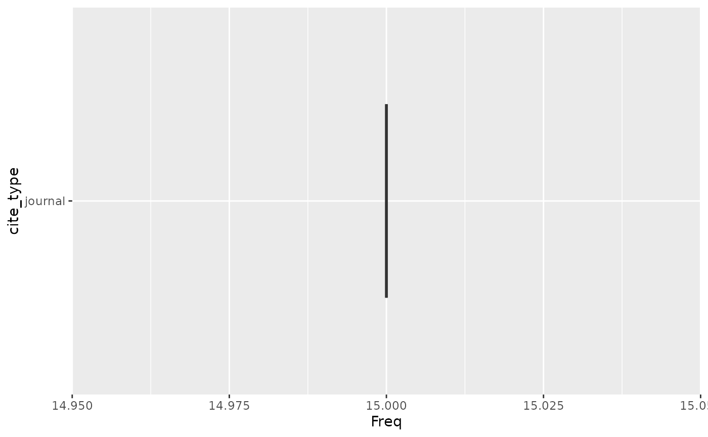
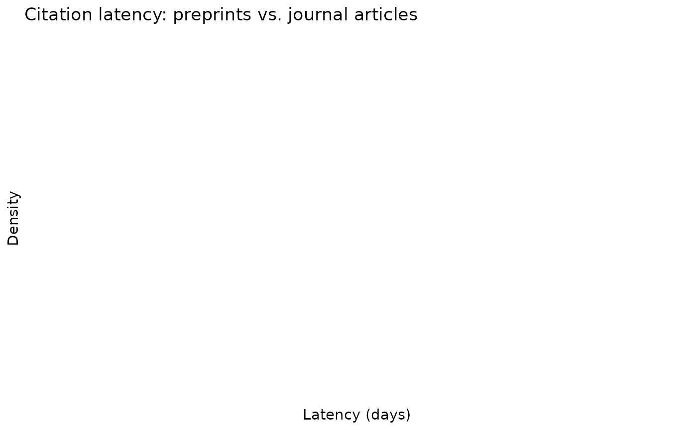

# Getting Started with wikilite

## 1. Installation

``` r
# CRAN (once available):
install.packages("wikilite")

# Development version from GitHub:
remotes::install_github("jsobel1/wikilite")
```

## 2. Single-article workflow

The basic workflow fetches the most recent revision of an article and
computes quality metrics.

``` r
library(wikilite)

# Fetch the most recent revision of Zeitgeber
art <- get_article_most_recent_table("Zeitgeber")

# SciScore: proportion of journal citations (0–1)
get_sci_score(art$`*`)
#> [1] 1

# Raw counts
get_doi_count(art$`*`)
#> [1] 13
get_refCount(art$`*`)
#> [1] 16
```

Results are cached to disk by default — subsequent calls with the same
arguments return instantly.

## 3. Category workflow

``` r
# Get all article titles in a Wikipedia category
articles <- get_pagename_in_cat("Circadian rhythm")

# Fetch most recent revisions for all articles
recent <- get_category_articles_most_recent(articles)

# Or fetch in parallel with 4 workers (requires furrr + future)
history <- get_category_articles_history(articles, workers = 4L)
```

## 4. Multilingual support

All API functions accept a `lang` parameter:

``` r
# French Wikipedia
fr_art <- get_article_most_recent_table("COVID-19", lang = "fr")

# German Wikipedia category
de_articles <- get_pagename_in_cat("Chronobiologie", lang = "de")
```

## 5. Citation extraction and parsing

``` r
art <- get_article_most_recent_table("Zeitgeber")

# Extract all DOIs
doi_df <- get_regex_citations_in_wiki_table(art, pkg.env$doi_regexp)

# Parse all CS1 templates into a tidy data frame
parsed <- get_parsed_citations(art)
head(parsed)
#>                                                                                                                                                                                                                                                                                     art
#>  journal |doi=10.1001/archpsyc.1988.01800340076012|title=Social Zeitgebers and Biological Rhythms|year=1988|last1=Ehlers|first1=Cindy L.|last2=Frank|first2=E.|last3=Kupfer|first3=D. J.|journal=Archives of General Psychiatry|volume=45|issue=10|pages=948–52|pmid=30482261 Zeitgeber
#>  journal |doi=10.1001/archpsyc.1988.01800340076012|title=Social Zeitgebers and Biological Rhythms|year=1988|last1=Ehlers|first1=Cindy L.|last2=Frank|first2=E.|last3=Kupfer|first3=D. J.|journal=Archives of General Psychiatry|volume=45|issue=10|pages=948–52|pmid=30482262 Zeitgeber
#>  journal |doi=10.1001/archpsyc.1988.01800340076012|title=Social Zeitgebers and Biological Rhythms|year=1988|last1=Ehlers|first1=Cindy L.|last2=Frank|first2=E.|last3=Kupfer|first3=D. J.|journal=Archives of General Psychiatry|volume=45|issue=10|pages=948–52|pmid=30482263 Zeitgeber
#>  journal |doi=10.1001/archpsyc.1988.01800340076012|title=Social Zeitgebers and Biological Rhythms|year=1988|last1=Ehlers|first1=Cindy L.|last2=Frank|first2=E.|last3=Kupfer|first3=D. J.|journal=Archives of General Psychiatry|volume=45|issue=10|pages=948–52|pmid=30482264 Zeitgeber
#>  journal |doi=10.1001/archpsyc.1988.01800340076012|title=Social Zeitgebers and Biological Rhythms|year=1988|last1=Ehlers|first1=Cindy L.|last2=Frank|first2=E.|last3=Kupfer|first3=D. J.|journal=Archives of General Psychiatry|volume=45|issue=10|pages=948–52|pmid=30482265 Zeitgeber
#>  journal |doi=10.1001/archpsyc.1988.01800340076012|title=Social Zeitgebers and Biological Rhythms|year=1988|last1=Ehlers|first1=Cindy L.|last2=Frank|first2=E.|last3=Kupfer|first3=D. J.|journal=Archives of General Psychiatry|volume=45|issue=10|pages=948–52|pmid=30482266 Zeitgeber
#>                                                                                                                                                                                                                                                                                    revid
#>  journal |doi=10.1001/archpsyc.1988.01800340076012|title=Social Zeitgebers and Biological Rhythms|year=1988|last1=Ehlers|first1=Cindy L.|last2=Frank|first2=E.|last3=Kupfer|first3=D. J.|journal=Archives of General Psychiatry|volume=45|issue=10|pages=948–52|pmid=30482261 1330736183
#>  journal |doi=10.1001/archpsyc.1988.01800340076012|title=Social Zeitgebers and Biological Rhythms|year=1988|last1=Ehlers|first1=Cindy L.|last2=Frank|first2=E.|last3=Kupfer|first3=D. J.|journal=Archives of General Psychiatry|volume=45|issue=10|pages=948–52|pmid=30482262 1330736183
#>  journal |doi=10.1001/archpsyc.1988.01800340076012|title=Social Zeitgebers and Biological Rhythms|year=1988|last1=Ehlers|first1=Cindy L.|last2=Frank|first2=E.|last3=Kupfer|first3=D. J.|journal=Archives of General Psychiatry|volume=45|issue=10|pages=948–52|pmid=30482263 1330736183
#>  journal |doi=10.1001/archpsyc.1988.01800340076012|title=Social Zeitgebers and Biological Rhythms|year=1988|last1=Ehlers|first1=Cindy L.|last2=Frank|first2=E.|last3=Kupfer|first3=D. J.|journal=Archives of General Psychiatry|volume=45|issue=10|pages=948–52|pmid=30482264 1330736183
#>  journal |doi=10.1001/archpsyc.1988.01800340076012|title=Social Zeitgebers and Biological Rhythms|year=1988|last1=Ehlers|first1=Cindy L.|last2=Frank|first2=E.|last3=Kupfer|first3=D. J.|journal=Archives of General Psychiatry|volume=45|issue=10|pages=948–52|pmid=30482265 1330736183
#>  journal |doi=10.1001/archpsyc.1988.01800340076012|title=Social Zeitgebers and Biological Rhythms|year=1988|last1=Ehlers|first1=Cindy L.|last2=Frank|first2=E.|last3=Kupfer|first3=D. J.|journal=Archives of General Psychiatry|volume=45|issue=10|pages=948–52|pmid=30482266 1330736183
#>                                                                                                                                                                                                                                                                                  type
#>  journal |doi=10.1001/archpsyc.1988.01800340076012|title=Social Zeitgebers and Biological Rhythms|year=1988|last1=Ehlers|first1=Cindy L.|last2=Frank|first2=E.|last3=Kupfer|first3=D. J.|journal=Archives of General Psychiatry|volume=45|issue=10|pages=948–52|pmid=30482261 journal
#>  journal |doi=10.1001/archpsyc.1988.01800340076012|title=Social Zeitgebers and Biological Rhythms|year=1988|last1=Ehlers|first1=Cindy L.|last2=Frank|first2=E.|last3=Kupfer|first3=D. J.|journal=Archives of General Psychiatry|volume=45|issue=10|pages=948–52|pmid=30482262 journal
#>  journal |doi=10.1001/archpsyc.1988.01800340076012|title=Social Zeitgebers and Biological Rhythms|year=1988|last1=Ehlers|first1=Cindy L.|last2=Frank|first2=E.|last3=Kupfer|first3=D. J.|journal=Archives of General Psychiatry|volume=45|issue=10|pages=948–52|pmid=30482263 journal
#>  journal |doi=10.1001/archpsyc.1988.01800340076012|title=Social Zeitgebers and Biological Rhythms|year=1988|last1=Ehlers|first1=Cindy L.|last2=Frank|first2=E.|last3=Kupfer|first3=D. J.|journal=Archives of General Psychiatry|volume=45|issue=10|pages=948–52|pmid=30482264 journal
#>  journal |doi=10.1001/archpsyc.1988.01800340076012|title=Social Zeitgebers and Biological Rhythms|year=1988|last1=Ehlers|first1=Cindy L.|last2=Frank|first2=E.|last3=Kupfer|first3=D. J.|journal=Archives of General Psychiatry|volume=45|issue=10|pages=948–52|pmid=30482265 journal
#>  journal |doi=10.1001/archpsyc.1988.01800340076012|title=Social Zeitgebers and Biological Rhythms|year=1988|last1=Ehlers|first1=Cindy L.|last2=Frank|first2=E.|last3=Kupfer|first3=D. J.|journal=Archives of General Psychiatry|volume=45|issue=10|pages=948–52|pmid=30482266 journal
#>                                                                                                                                                                                                                                                                               id_cite
#>  journal |doi=10.1001/archpsyc.1988.01800340076012|title=Social Zeitgebers and Biological Rhythms|year=1988|last1=Ehlers|first1=Cindy L.|last2=Frank|first2=E.|last3=Kupfer|first3=D. J.|journal=Archives of General Psychiatry|volume=45|issue=10|pages=948–52|pmid=30482261       1
#>  journal |doi=10.1001/archpsyc.1988.01800340076012|title=Social Zeitgebers and Biological Rhythms|year=1988|last1=Ehlers|first1=Cindy L.|last2=Frank|first2=E.|last3=Kupfer|first3=D. J.|journal=Archives of General Psychiatry|volume=45|issue=10|pages=948–52|pmid=30482262       1
#>  journal |doi=10.1001/archpsyc.1988.01800340076012|title=Social Zeitgebers and Biological Rhythms|year=1988|last1=Ehlers|first1=Cindy L.|last2=Frank|first2=E.|last3=Kupfer|first3=D. J.|journal=Archives of General Psychiatry|volume=45|issue=10|pages=948–52|pmid=30482263       1
#>  journal |doi=10.1001/archpsyc.1988.01800340076012|title=Social Zeitgebers and Biological Rhythms|year=1988|last1=Ehlers|first1=Cindy L.|last2=Frank|first2=E.|last3=Kupfer|first3=D. J.|journal=Archives of General Psychiatry|volume=45|issue=10|pages=948–52|pmid=30482264       1
#>  journal |doi=10.1001/archpsyc.1988.01800340076012|title=Social Zeitgebers and Biological Rhythms|year=1988|last1=Ehlers|first1=Cindy L.|last2=Frank|first2=E.|last3=Kupfer|first3=D. J.|journal=Archives of General Psychiatry|volume=45|issue=10|pages=948–52|pmid=30482265       1
#>  journal |doi=10.1001/archpsyc.1988.01800340076012|title=Social Zeitgebers and Biological Rhythms|year=1988|last1=Ehlers|first1=Cindy L.|last2=Frank|first2=E.|last3=Kupfer|first3=D. J.|journal=Archives of General Psychiatry|volume=45|issue=10|pages=948–52|pmid=30482266       1
#>                                                                                                                                                                                                                                                                               variable
#>  journal |doi=10.1001/archpsyc.1988.01800340076012|title=Social Zeitgebers and Biological Rhythms|year=1988|last1=Ehlers|first1=Cindy L.|last2=Frank|first2=E.|last3=Kupfer|first3=D. J.|journal=Archives of General Psychiatry|volume=45|issue=10|pages=948–52|pmid=30482261      doi
#>  journal |doi=10.1001/archpsyc.1988.01800340076012|title=Social Zeitgebers and Biological Rhythms|year=1988|last1=Ehlers|first1=Cindy L.|last2=Frank|first2=E.|last3=Kupfer|first3=D. J.|journal=Archives of General Psychiatry|volume=45|issue=10|pages=948–52|pmid=30482262    title
#>  journal |doi=10.1001/archpsyc.1988.01800340076012|title=Social Zeitgebers and Biological Rhythms|year=1988|last1=Ehlers|first1=Cindy L.|last2=Frank|first2=E.|last3=Kupfer|first3=D. J.|journal=Archives of General Psychiatry|volume=45|issue=10|pages=948–52|pmid=30482263     year
#>  journal |doi=10.1001/archpsyc.1988.01800340076012|title=Social Zeitgebers and Biological Rhythms|year=1988|last1=Ehlers|first1=Cindy L.|last2=Frank|first2=E.|last3=Kupfer|first3=D. J.|journal=Archives of General Psychiatry|volume=45|issue=10|pages=948–52|pmid=30482264    last1
#>  journal |doi=10.1001/archpsyc.1988.01800340076012|title=Social Zeitgebers and Biological Rhythms|year=1988|last1=Ehlers|first1=Cindy L.|last2=Frank|first2=E.|last3=Kupfer|first3=D. J.|journal=Archives of General Psychiatry|volume=45|issue=10|pages=948–52|pmid=30482265   first1
#>  journal |doi=10.1001/archpsyc.1988.01800340076012|title=Social Zeitgebers and Biological Rhythms|year=1988|last1=Ehlers|first1=Cindy L.|last2=Frank|first2=E.|last3=Kupfer|first3=D. J.|journal=Archives of General Psychiatry|volume=45|issue=10|pages=948–52|pmid=30482266    last2
#>                                                                                                                                                                                                                                                                                                                  value
#>  journal |doi=10.1001/archpsyc.1988.01800340076012|title=Social Zeitgebers and Biological Rhythms|year=1988|last1=Ehlers|first1=Cindy L.|last2=Frank|first2=E.|last3=Kupfer|first3=D. J.|journal=Archives of General Psychiatry|volume=45|issue=10|pages=948–52|pmid=30482261     10.1001/archpsyc.1988.01800340076012
#>  journal |doi=10.1001/archpsyc.1988.01800340076012|title=Social Zeitgebers and Biological Rhythms|year=1988|last1=Ehlers|first1=Cindy L.|last2=Frank|first2=E.|last3=Kupfer|first3=D. J.|journal=Archives of General Psychiatry|volume=45|issue=10|pages=948–52|pmid=30482262 Social Zeitgebers and Biological Rhythms
#>  journal |doi=10.1001/archpsyc.1988.01800340076012|title=Social Zeitgebers and Biological Rhythms|year=1988|last1=Ehlers|first1=Cindy L.|last2=Frank|first2=E.|last3=Kupfer|first3=D. J.|journal=Archives of General Psychiatry|volume=45|issue=10|pages=948–52|pmid=30482263                                     1988
#>  journal |doi=10.1001/archpsyc.1988.01800340076012|title=Social Zeitgebers and Biological Rhythms|year=1988|last1=Ehlers|first1=Cindy L.|last2=Frank|first2=E.|last3=Kupfer|first3=D. J.|journal=Archives of General Psychiatry|volume=45|issue=10|pages=948–52|pmid=30482264                                   Ehlers
#>  journal |doi=10.1001/archpsyc.1988.01800340076012|title=Social Zeitgebers and Biological Rhythms|year=1988|last1=Ehlers|first1=Cindy L.|last2=Frank|first2=E.|last3=Kupfer|first3=D. J.|journal=Archives of General Psychiatry|volume=45|issue=10|pages=948–52|pmid=30482265                                 Cindy L.
#>  journal |doi=10.1001/archpsyc.1988.01800340076012|title=Social Zeitgebers and Biological Rhythms|year=1988|last1=Ehlers|first1=Cindy L.|last2=Frank|first2=E.|last3=Kupfer|first3=D. J.|journal=Archives of General Psychiatry|volume=45|issue=10|pages=948–52|pmid=30482266                                    Frank

# Citation type breakdown
ct <- get_citation_type(art)
plot_distribution_source_type(ct)
```



## 6. Interactive visualisations

``` r
articles <- c("Zeitgeber", "Circadian rhythm", "Sleep deprivation",
              "Advanced sleep phase disorder")

# Gantt-style timeline
plot_interactive_timeline(articles)
```

``` r

# Article–publication bipartite network
plot_article_publication_network(articles, min_wiki_count = 2)
```

``` r

# Co-citation network
plot_article_cocitation_network(articles, min_shared_dois = 3)
```

``` r

# Wikilink network
plot_article_wikilink_network(articles)
```

## 7. Annotation (EuropePMC, CrossRef)

``` r
# Annotate DOIs with EuropePMC metadata
doi_list <- unique(doi_df$citation_fetched)
epmc_df  <- annotate_doi_list_europmc(doi_list[1:10])

# BibTeX export via CrossRef
export_doi_to_bib(doi_list[1:5], file_name = "my_refs.bib")
#>   |                                                                              |                                                                      |   0%  |                                                                              |==============                                                        |  20%  |                                                                              |============================                                          |  40%  |                                                                              |==========================================                            |  60%  |                                                                              |========================================================              |  80%  |                                                                              |======================================================================| 100%

# Top cited papers
top <- get_top_cited_wiki_papers(doi_df)
```

## 8. Edit trend analysis

``` r
# Count revert-tagged edits for a one-hour window
reverts <- get_revert_counts("20181212010000", "20181212000000")
head(reverts)
#>                       art sum_nb_reverts
#> 1                Figueroa              4
#> 2             Radim Šimek              4
#> 3       Admiral Schofield              2
#> 4 Alex Oxlade-Chamberlain              2
#> 5               Bad Bunny              2
#> 6             Don Shirley              2

# Count ALL edits instead
all_edits <- get_revert_counts("20181212010000", "20181212000000",
                                rev_eds = FALSE)
```

## 9. Latency analysis (new in v0.1.0)

``` r
# Compute citation latency: days from paper publication to Wikipedia insertion
latency_df <- compute_citation_latency(doi_df, epmc_df)

# Plot the distribution, stratified by preprint vs. journal
plot_latency_distribution(latency_df, stratify_by = "is_preprint")
```



``` r

# Segment plot of individual DOI latencies
get_segment_history_doi_plot(latency_df, "Zeitgeber")
```


``` r

# Dot plot showing insertion timing
get_dotplot_history(latency_df, "Zeitgeber")
```


## 10. Time-series probing

Fetch snapshots of an article at several historical dates by looping
over
[`get_article_most_recent_table()`](https://jsobel1.github.io/wikilite/reference/get_article_most_recent_table.md)
with different `date_an` arguments, then apply quality metrics to each
snapshot.

``` r
dates <- paste0(2019:2024, "-01-01T00:00:00Z")

probe_df <- do.call(rbind, lapply(dates, function(d) {
  snap <- get_article_most_recent_table("Zeitgeber", date_an = d)
  data.frame(
    date      = as.Date(d),
    sci_score = get_sci_score(snap$`*`),
    doi_count = get_doi_count(snap$`*`),
    ref_count = get_refCount(snap$`*`)
  )
}))

probe_df
#>         date sci_score doi_count ref_count
#> 1 2019-01-01 0.7500000         2        18
#> 2 2020-01-01 0.8000000         3        19
#> 3 2021-01-01 0.9444444        14        19
#> 4 2022-01-01 0.9444444        14        19
#> 5 2023-01-01 0.9444444        14        19
#> 6 2024-01-01 0.9444444        14        19
```

## 11. Cache management

``` r
# See where the cache lives
wiki_cache_dir()
#> [1] "/home/runner/.cache/R/wikilite"

# Clear all cached responses (forces fresh API calls)
wiki_clear_cache()
```

## 12. Exporting results

``` r
# Write revision table to Excel
write_wiki_history_to_xlsx(art, "zeitgeber",
                            dir = tempdir())

# Export all regex matches to separate Excel files
export_extracted_citations_xlsx(recent, "circadian_articles")
```
