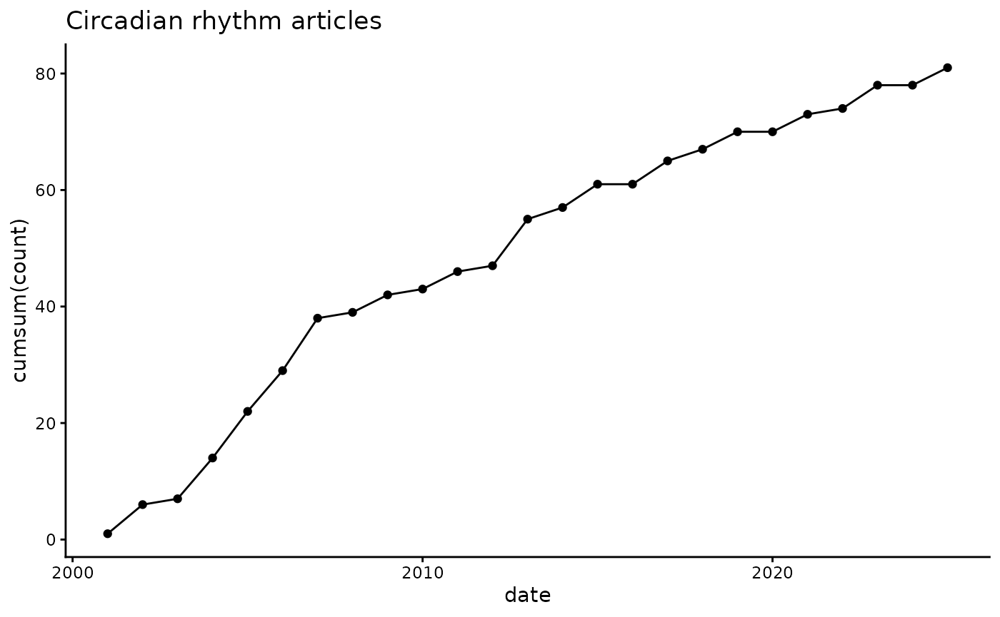
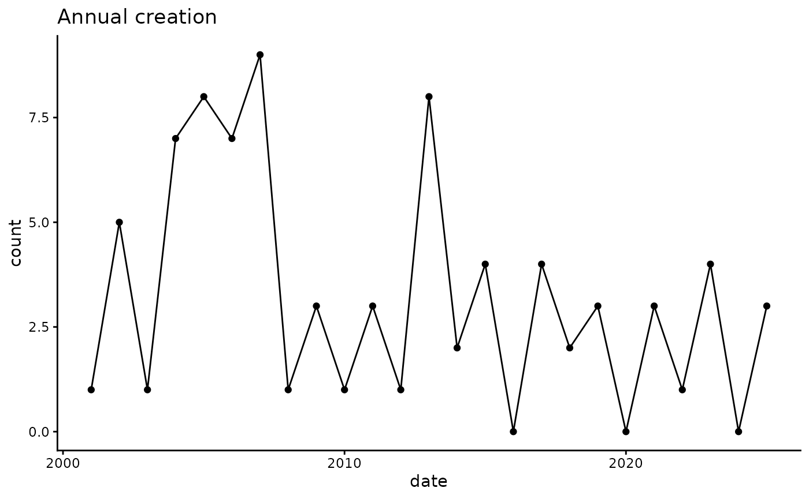
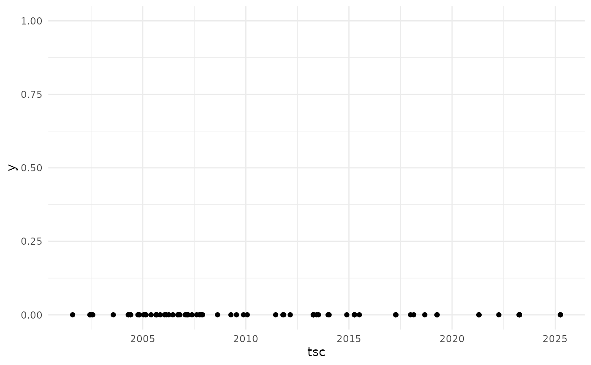
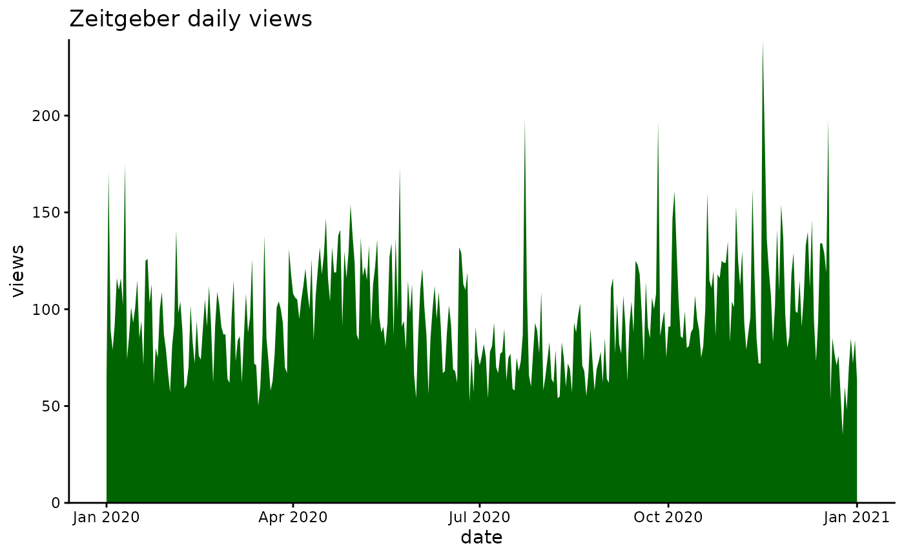
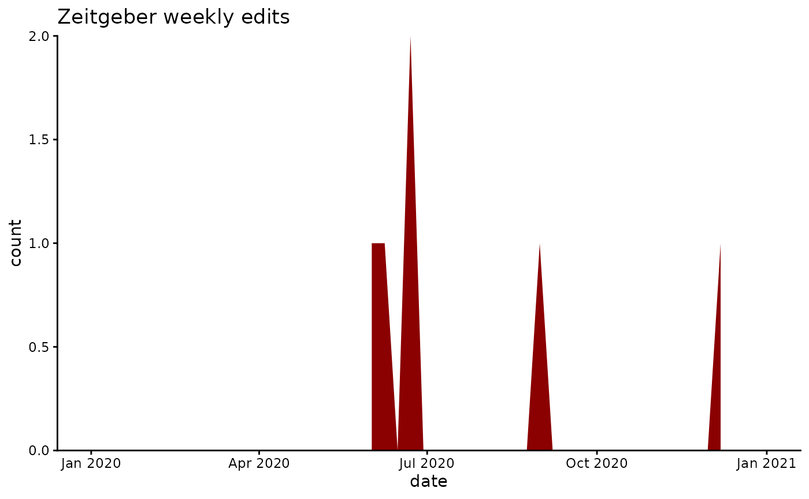

# Introduction to wikilite

## Overview

**wikilite** is an R toolkit for mining Wikipedia article revision
history and citations. It connects to the public MediaWiki API to
retrieve structured data frames that are ready for downstream analysis,
annotation, and visualisation.

Key capabilities:

| Area                | Key functions                                                                                                                                                                                                                                              |
|---------------------|------------------------------------------------------------------------------------------------------------------------------------------------------------------------------------------------------------------------------------------------------------|
| History retrieval   | [`get_article_full_history_table()`](https://jsobel1.github.io/wikilite/reference/get_article_full_history_table.md), [`get_article_most_recent_table()`](https://jsobel1.github.io/wikilite/reference/get_article_most_recent_table.md)                   |
| Category navigation | [`get_pagename_in_cat()`](https://jsobel1.github.io/wikilite/reference/get_pagename_in_cat.md), [`get_subcat_with_depth()`](https://jsobel1.github.io/wikilite/reference/get_subcat_with_depth.md)                                                         |
| Citation counting   | [`get_doi_count()`](https://jsobel1.github.io/wikilite/reference/get_doi_count.md), [`get_refCount()`](https://jsobel1.github.io/wikilite/reference/get_refCount.md), [`get_ISBN_count()`](https://jsobel1.github.io/wikilite/reference/get_ISBN_count.md) |
| Citation parsing    | [`parse_article_ALL_citations()`](https://jsobel1.github.io/wikilite/reference/parse_article_ALL_citations.md), [`get_parsed_citations()`](https://jsobel1.github.io/wikilite/reference/get_parsed_citations.md)                                           |
| Quality metrics     | [`get_sci_score()`](https://jsobel1.github.io/wikilite/reference/get_sci_score.md), [`get_sci_score2()`](https://jsobel1.github.io/wikilite/reference/get_sci_score2.md)                                                                                   |
| Annotation          | [`annotate_doi_list_europmc()`](https://jsobel1.github.io/wikilite/reference/annotate_doi_list_europmc.md), [`annotate_doi_list_cross_ref()`](https://jsobel1.github.io/wikilite/reference/annotate_doi_list_cross_ref.md)                                 |
| Revert trends       | [`get_revert_counts()`](https://jsobel1.github.io/wikilite/reference/get_revert_counts.md)                                                                                                                                                                 |
| Visualisation       | [`plot_article_creation_per_year()`](https://jsobel1.github.io/wikilite/reference/plot_article_creation_per_year.md), [`page_edit_plot()`](https://jsobel1.github.io/wikilite/reference/page_edit_plot.md)                                                 |

## Installation

``` r
# CRAN (once available)
install.packages("wikilite")

# Development version from GitHub
remotes::install_github("jsobel1/wikilite")
```

## Quick-start: a single article

``` r
library(wikilite)

# Most recent revision of the Zeitgeber article
recent <- get_article_most_recent_table("Zeitgeber")

# The data frame has columns: art, revid, user, timestamp, size, comment, *
# The "*" column contains the full raw wikitext.
names(recent)
#> [1] "art"       "revid"     "parentid"  "user"      "userid"    "timestamp"
#> [7] "size"      "comment"   "*"
```

Count citations directly from the wikitext:

``` r
text <- recent$`*`

get_doi_count(text)        # number of DOIs
#> [1] 13
get_refCount(text)         # number of <ref>...</ref> blocks
#> [1] 16
get_ISBN_count(text)       # number of ISBNs
#> [1] 0
get_hyperlinkCount(text)   # number of [[...]] links
#> [1] 33
get_sci_score(text)        # fraction of citations that are journal citations
#> [1] 1
```

## Multiple articles via a category

``` r
# List all articles in a Wikipedia category
sleep_articles <- get_pagename_in_cat("Circadian rhythm")
head(sleep_articles)
#> [1] "Chronodisruption"  "Circadian rhythm"  "AANAT (gene)"     
#> [4] "N-Acetylserotonin" "Actigraphy"        "Actogram"

# Fetch the most recent revision for each article
sleep_recent <- get_category_articles_most_recent(sleep_articles)
```

## Extract DOIs

``` r
doi_regexp <- pkg.env$doi_regexp   # "10\\.\\d{4,9}/[-._;()/:a-z0-9A-Z]+"

dois <- get_regex_citations_in_wiki_table(sleep_recent, doi_regexp)
head(dois)
#>                art      revid                 citation_fetched
#> 1 Chronodisruption 1340992483 10.1111/j.1600-079X.2009.00665.x
#> 2 Chronodisruption 1340992483              10.1530/REP-20-0298
#> 3 Chronodisruption 1340992483      10.1016/j.exger.2022.112076
#> 4 Chronodisruption 1340992483    10.1080/07420528.2019.1683570
#> 5 Chronodisruption 1340992483        10.1038/s41398-020-0694-0
#> 6 Chronodisruption 1340992483    10.1161/CIRCRESAHA.123.323520
```

## Visualise article creation over time

``` r
initial <- get_category_articles_creation(sleep_articles)

# Cumulative count (default)
plot_article_creation_per_year(initial, name_title = "Circadian rhythm articles")
```



``` r

# Annual counts
plot_article_creation_per_year(initial, name_title = "Annual creation",
                               Cumsum = FALSE)
```



## Static article timeline

``` r
plot_static_timeline(initial)
```



## Page-view and edit-activity plots

``` r
# Daily page views
page_view_plot("Zeitgeber", start = "2020010100", end = "2021010100")
```



``` r

# Weekly edits
page_edit_plot("Zeitgeber", start = "2020010100", end = "2021010100")
```



## Export to Excel and BibTeX

``` r
# Revision table → Excel
write_wiki_history_to_xlsx(recent, "zeitgeber")

# All regex matches → one xlsx file per pattern
export_extracted_citations_xlsx(sleep_recent, "sleep_articles")

# DOIs → BibTeX
export_doi_to_bib(unique(dois$citation_fetched)[1:10], "references.bib")
#>   |                                                                              |                                                                      |   0%  |                                                                              |=======                                                               |  10%  |                                                                              |==============                                                        |  20%  |                                                                              |=====================                                                 |  30%  |                                                                              |============================                                          |  40%  |                                                                              |===================================                                   |  50%  |                                                                              |==========================================                            |  60%  |                                                                              |=================================================                     |  70%  |                                                                              |========================================================              |  80%  |                                                                              |===============================================================       |  90%  |                                                                              |======================================================================| 100%
```

## Next steps

- **Citation Analysis** vignette — deep dive into CS1 template parsing,
  SciScore, and top-cited paper identification.
- **Annotation Workflow** vignette — enrich extracted DOIs and ISBNs
  with metadata from EuropePMC, CrossRef, Altmetric, Google Books, and
  Open Library.
