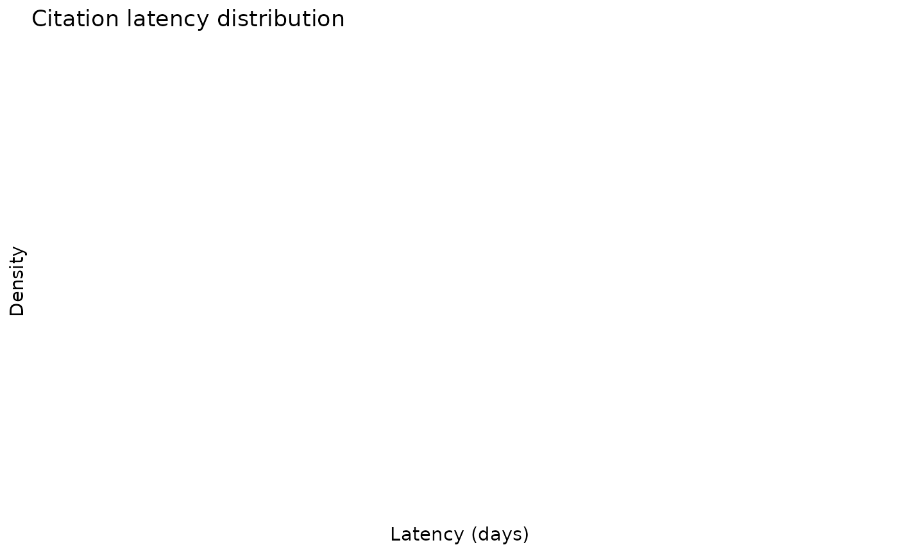
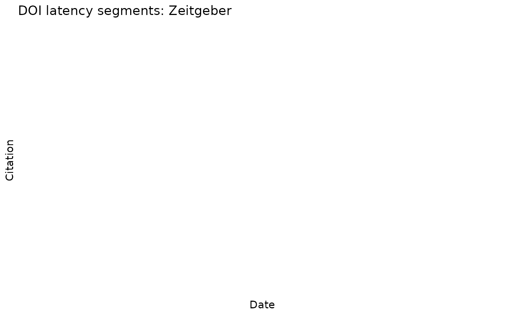
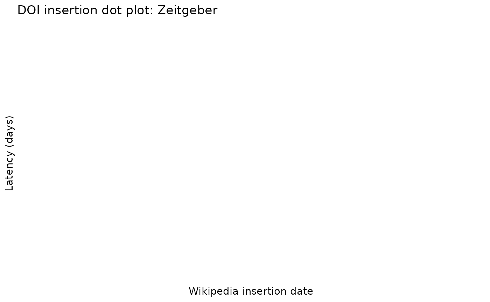

# Multi-Article Analysis and Interactive Networks

## Overview

**wikilite** includes a suite of interactive visualisations for
comparing multiple Wikipedia articles simultaneously. This vignette
covers:

1.  Building article lists from category pages
2.  The interactive Gantt-style timeline
3.  Three network visualisations (co-citation, publication, wikilink)
4.  Citation latency analysis across articles

All network functions require **visNetwork**
(`install.packages("visNetwork")`).

## 1. Build an article list

You can supply article titles directly or derive them from a Wikipedia
category.

``` r

library(wikilite)

# Option A — explicit titles
articles <- c(
  "Zeitgeber",
  "Circadian rhythm",
  "Sleep deprivation",
  "Advanced sleep phase disorder",
  "Non-24-hour sleep-wake disorder"
)

# Option B — browse a category
sleep_articles <- get_pagename_in_cat("Circadian rhythm")
head(sleep_articles)
#> [1] "Chronodisruption"                 "Circadian rhythm"                
#> [3] "N-Acetylserotonin"                "Actigraphy"                      
#> [5] "Actogram"                         "Aralkylamine N-acetyltransferase"

# Option C — explore subcategories first
subcats <- get_subcat_table("Chronobiology")
head(subcats)
#>     pageid ns                     title   type            timestamp
#> 1 48471439 14 Category:Chronobiologists subcat 2025-06-17T05:49:30Z
#> 2 37000069 14 Category:Circadian rhythm subcat 2025-06-17T02:11:48Z
#> 3 19522768 14      Category:Homeostasis subcat 2025-06-16T20:16:34Z
#>               parent_cat
#> 1 Category:Chronobiology
#> 2 Category:Chronobiology
#> 3 Category:Chronobiology

# Then pull articles from a chosen subcategory
sub_articles <- get_pagename_in_cat("Sleep disorders")
```

## 2. Interactive Gantt timeline

[`plot_interactive_timeline()`](https://jsobel1.github.io/wikilite/reference/plot_interactive_timeline.md)
shows each article as a horizontal bar spanning from its creation date
to its last edit, coloured by a chosen metric.

``` r

# Default: colour bars by SciScore
plot_interactive_timeline(articles)
```

``` r


# Colour by current article size instead
plot_interactive_timeline(articles, color_by = "size")
```

``` r


# No colouring — uniform colour for clean presentation
plot_interactive_timeline(articles, color_by = "none")
```

``` r


# Restrict to a historical snapshot
plot_interactive_timeline(articles, date_an = "2021-01-01T00:00:00Z")
```

``` r


# French Wikipedia
plot_interactive_timeline(
  c("COVID-19", "Syndrome respiratoire aigu sévère"),
  lang = "fr"
)
```

Hovering over a bar shows the article name, creation date, last-edit
date, first editor, and SciScore. Clicking a dot opens the article on
Wikipedia.

## 3. Co-citation network

Articles sharing at least `min_shared_dois` DOIs are connected by an
edge. Node size scales with the number of shared citations; thicker
edges indicate more overlap.

``` r

# Articles sharing ≥ 1 DOI (default)
plot_article_cocitation_network(articles)
```

``` r


# Require ≥ 3 shared DOIs for an edge (cleaner graph)
plot_article_cocitation_network(articles, min_shared_dois = 3)
```

The network is interactive: drag nodes, zoom, and click any node to open
the Wikipedia article in a new tab.

## 4. Publication bipartite network

A bipartite (two-mode) network where **article** nodes (blue boxes)
connect to **DOI** nodes (orange dots). Node size indicates how many
articles cite each DOI, making highly shared papers immediately visible.

``` r

# Show papers cited by ≥ 2 articles (default)
plot_article_publication_network(articles)
```

``` r


# Show up to 80 top DOIs, require at least 3 citing articles
tryCatch(
  plot_article_publication_network(
    articles,
    top_n_dois     = 80L,
    min_wiki_count = 3L
  ),
  error = function(e) message("Note: ", conditionMessage(e))
)

# Enrich paper nodes with EuropePMC metadata (title, journal, year)
plot_article_publication_network(articles, annotate = TRUE)
```

DOI nodes link directly to `doi.org` when clicked.

## 5. Wikilink network

Shows how articles in your set link **to** each other. Directed edges
point from the linking article to the linked article. By default, only
links between articles in your list are shown (`only_internal = TRUE`).

``` r

# Only links between articles in the list
plot_article_wikilink_network(articles)
```

``` r


# Also include outgoing links to other Wikipedia articles
plot_article_wikilink_network(articles,
                               only_internal = FALSE,
                               top_n_links   = 60L)
```

## 6. Citation latency analysis

How long after a paper is published does it take to appear in Wikipedia?
Use
[`compute_citation_latency()`](https://jsobel1.github.io/wikilite/reference/compute_citation_latency.md)
together with EuropePMC annotation.

``` r

# Fetch most recent revisions
recent  <- get_category_articles_most_recent(articles)

# Extract DOIs
doi_df  <- get_regex_citations_in_wiki_table(recent, pkg.env$doi_regexp)

# Annotate with EuropePMC publication dates
epmc_df <- annotate_doi_list_europmc(unique(doi_df$citation_fetched))

# Compute latency (days from publication → Wikipedia insertion)
latency <- compute_citation_latency(doi_df, epmc_df)

# Overall latency distribution
plot_latency_distribution(latency)
```



``` r


# Stratified: preprints vs. journal articles (includes KS-test p-value)
plot_latency_distribution(latency, stratify_by = "is_preprint")
```


``` r


# Segment plot: each DOI's gap as a horizontal line
get_segment_history_doi_plot(latency, "Zeitgeber")
```



``` r


# Scatter: insertion date vs. latency
get_dotplot_history(latency, "Zeitgeber")
```



Key columns in the latency data frame:

| Column                 | Description                                   |
|------------------------|-----------------------------------------------|
| `citation_fetched`     | DOI                                           |
| `firstPublicationDate` | EuropePMC publication date                    |
| `latency_days`         | Days from publication to Wikipedia insertion  |
| `is_preprint`          | `TRUE` for bioRxiv/medRxiv DOIs (`10.1101/…`) |

## 7. Batch workflow example

The following code replicates a typical research workflow: browse a
category, download recent revisions, extract citations, annotate, and
visualise.

``` r

library(wikilite)

# 1. Browse the category tree
subcats <- get_subcat_table("Chronobiology")

# 2. Choose a category and list its articles
articles <- get_pagename_in_cat("Circadian rhythm")

# 3. Visualise the timeline
plot_interactive_timeline(articles, color_by = "sciscore")
```

``` r


# 4. Explore citation sharing
plot_article_cocitation_network(articles, min_shared_dois = 2)
```

``` r

plot_article_publication_network(articles, annotate = TRUE)
```

``` r


# 5. Latency analysis
recent  <- get_category_articles_most_recent(articles)
doi_df  <- get_regex_citations_in_wiki_table(recent, pkg.env$doi_regexp)
epmc_df <- annotate_doi_list_europmc(unique(doi_df$citation_fetched))
latency <- compute_citation_latency(doi_df, epmc_df)
plot_latency_distribution(latency, stratify_by = "is_preprint")
```


``` r


# 6. Export
openxlsx::write.xlsx(latency, "circadian_latency.xlsx")
export_doi_to_bib(unique(doi_df$citation_fetched), "circadian_refs.bib")
#>   |                                                                              |                                                                      |   0%
#>   |                                                                              |                                                                      |   1%
#>   |                                                                              |=                                                                     |   1%
#>   |                                                                              |=                                                                     |   2%
#>   |                                                                              |==                                                                    |   2%
#>   |                                                                              |==                                                                    |   3%
#>   |                                                                              |==                                                                    |   4%
#>   |                                                                              |===                                                                   |   4%
#>   |                                                                              |===                                                                   |   5%
#>   |                                                                              |====                                                                  |   5%
#>   |                                                                              |====                                                                  |   6%
#>   |                                                                              |=====                                                                 |   6%
#>   |                                                                              |=====                                                                 |   7%
#>   |                                                                              |=====                                                                 |   8%
#>   |                                                                              |======                                                                |   8%
#>   |                                                                              |======                                                                |   9%
#>   |                                                                              |=======                                                               |   9%
#>   |                                                                              |=======                                                               |  10%
#>   |                                                                              |=======                                                               |  11%
#>   |                                                                              |========                                                              |  11%
#>   |                                                                              |========                                                              |  12%
#>   |                                                                              |=========                                                             |  12%
#>   |                                                                              |=========                                                             |  13%
#>   |                                                                              |=========                                                             |  14%
#>   |                                                                              |==========                                                            |  14%
#>   |                                                                              |==========                                                            |  15%
#>   |                                                                              |===========                                                           |  15%
#>   |                                                                              |===========                                                           |  16%
#>   |                                                                              |============                                                          |  16%
#>   |                                                                              |============                                                          |  17%
#>   |                                                                              |============                                                          |  18%
#>   |                                                                              |=============                                                         |  18%
#>   |                                                                              |=============                                                         |  19%
#>   |                                                                              |==============                                                        |  19%
#>   |                                                                              |==============                                                        |  20%
#>   |                                                                              |==============                                                        |  21%
#>   |                                                                              |===============                                                       |  21%
#>   |                                                                              |===============                                                       |  22%
#>   |                                                                              |================                                                      |  22%
#>   |                                                                              |================                                                      |  23%
#>   |                                                                              |================                                                      |  24%
#>   |                                                                              |=================                                                     |  24%
#>   |                                                                              |=================                                                     |  25%
#>   |                                                                              |==================                                                    |  25%
#>   |                                                                              |==================                                                    |  26%
#>   |                                                                              |===================                                                   |  26%
#>   |                                                                              |===================                                                   |  27%
#>   |                                                                              |===================                                                   |  28%
#>   |                                                                              |====================                                                  |  28%
#>   |                                                                              |====================                                                  |  29%
#>   |                                                                              |=====================                                                 |  29%
#>   |                                                                              |=====================                                                 |  30%
#>   |                                                                              |=====================                                                 |  31%
#>   |                                                                              |======================                                                |  31%
#>   |                                                                              |======================                                                |  32%
#>   |                                                                              |=======================                                               |  32%
#>   |                                                                              |=======================                                               |  33%
#>   |                                                                              |=======================                                               |  34%
#>   |                                                                              |========================                                              |  34%
#>   |                                                                              |========================                                              |  35%
#>   |                                                                              |=========================                                             |  35%
#>   |                                                                              |=========================                                             |  36%
#>   |                                                                              |==========================                                            |  36%
#>   |                                                                              |==========================                                            |  37%
#>   |                                                                              |==========================                                            |  38%
#>   |                                                                              |===========================                                           |  38%
#>   |                                                                              |===========================                                           |  39%
#>   |                                                                              |============================                                          |  39%
#>   |                                                                              |============================                                          |  40%
#>   |                                                                              |============================                                          |  41%
#>   |                                                                              |=============================                                         |  41%
#>   |                                                                              |=============================                                         |  42%
#>   |                                                                              |==============================                                        |  42%
#>   |                                                                              |==============================                                        |  43%
#>   |                                                                              |==============================                                        |  44%
#>   |                                                                              |===============================                                       |  44%
#>   |                                                                              |===============================                                       |  45%
#>   |                                                                              |================================                                      |  45%
#>   |                                                                              |================================                                      |  46%
#>   |                                                                              |=================================                                     |  46%
#>   |                                                                              |=================================                                     |  47%
#>   |                                                                              |=================================                                     |  48%
#>   |                                                                              |==================================                                    |  48%
#>   |                                                                              |==================================                                    |  49%
#>   |                                                                              |===================================                                   |  49%
#>   |                                                                              |===================================                                   |  50%
#>   |                                                                              |===================================                                   |  51%
#>   |                                                                              |====================================                                  |  51%
#>   |                                                                              |====================================                                  |  52%
#>   |                                                                              |=====================================                                 |  52%
#>   |                                                                              |=====================================                                 |  53%
#>   |                                                                              |=====================================                                 |  54%
#>   |                                                                              |======================================                                |  54%
#>   |                                                                              |======================================                                |  55%
#>   |                                                                              |=======================================                               |  55%
#>   |                                                                              |=======================================                               |  56%
#>   |                                                                              |========================================                              |  56%
#>   |                                                                              |========================================                              |  57%
#>   |                                                                              |========================================                              |  58%
#>   |                                                                              |=========================================                             |  58%
#>   |                                                                              |=========================================                             |  59%
#>   |                                                                              |==========================================                            |  59%
#>   |                                                                              |==========================================                            |  60%
#>   |                                                                              |==========================================                            |  61%
#>   |                                                                              |===========================================                           |  61%
#>   |                                                                              |===========================================                           |  62%
#>   |                                                                              |============================================                          |  62%
#>   |                                                                              |============================================                          |  63%
#>   |                                                                              |============================================                          |  64%
#>   |                                                                              |=============================================                         |  64%
#>   |                                                                              |=============================================                         |  65%
#>   |                                                                              |==============================================                        |  65%
#>   |                                                                              |==============================================                        |  66%
#>   |                                                                              |===============================================                       |  66%
#>   |                                                                              |===============================================                       |  67%
#>   |                                                                              |===============================================                       |  68%
#>   |                                                                              |================================================                      |  68%
#>   |                                                                              |================================================                      |  69%
#>   |                                                                              |=================================================                     |  69%
#>   |                                                                              |=================================================                     |  70%
#>   |                                                                              |=================================================                     |  71%
#>   |                                                                              |==================================================                    |  71%
#>   |                                                                              |==================================================                    |  72%
#>   |                                                                              |===================================================                   |  72%
#>   |                                                                              |===================================================                   |  73%
#>   |                                                                              |===================================================                   |  74%
#>   |                                                                              |====================================================                  |  74%
#>   |                                                                              |====================================================                  |  75%
#>   |                                                                              |=====================================================                 |  75%
#>   |                                                                              |=====================================================                 |  76%
#>   |                                                                              |======================================================                |  76%
#>   |                                                                              |======================================================                |  77%
#>   |                                                                              |======================================================                |  78%
#>   |                                                                              |=======================================================               |  78%
#>   |                                                                              |=======================================================               |  79%
#>   |                                                                              |========================================================              |  79%
#>   |                                                                              |========================================================              |  80%
#>   |                                                                              |========================================================              |  81%
#>   |                                                                              |=========================================================             |  81%
#>   |                                                                              |=========================================================             |  82%
#>   |                                                                              |==========================================================            |  82%
#>   |                                                                              |==========================================================            |  83%
#>   |                                                                              |==========================================================            |  84%
#>   |                                                                              |===========================================================           |  84%
#>   |                                                                              |===========================================================           |  85%
#>   |                                                                              |============================================================          |  85%
#>   |                                                                              |============================================================          |  86%
#>   |                                                                              |=============================================================         |  86%
#>   |                                                                              |=============================================================         |  87%
#>   |                                                                              |=============================================================         |  88%
#>   |                                                                              |==============================================================        |  88%
#>   |                                                                              |==============================================================        |  89%
#>   |                                                                              |===============================================================       |  89%
#>   |                                                                              |===============================================================       |  90%
#>   |                                                                              |===============================================================       |  91%
#>   |                                                                              |================================================================      |  91%
#>   |                                                                              |================================================================      |  92%
#>   |                                                                              |=================================================================     |  92%
#>   |                                                                              |=================================================================     |  93%
#>   |                                                                              |=================================================================     |  94%  |                                                                              |==================================================================    |  94%
#>   |                                                                              |==================================================================    |  95%
#>   |                                                                              |===================================================================   |  95%
#>   |                                                                              |===================================================================   |  96%
#>   |                                                                              |====================================================================  |  96%
#>   |                                                                              |====================================================================  |  97%
#>   |                                                                              |====================================================================  |  98%
#>   |                                                                              |===================================================================== |  98%
#>   |                                                                              |===================================================================== |  99%
#>   |                                                                              |======================================================================|  99%
#>   |                                                                              |======================================================================| 100%
```

## 8. Multilingual analysis

All functions accept a `lang` parameter for any Wikipedia language
edition.

``` r

# Compare sleep-science articles in French Wikipedia
fr_articles <- get_pagename_in_cat("Rythme circadien", lang = "fr")
plot_interactive_timeline(fr_articles, lang = "fr", color_by = "sciscore")
```

``` r


# Co-citation network in German Wikipedia
de_articles <- get_pagename_in_cat("Chronobiologie", lang = "de")
plot_article_cocitation_network(de_articles, lang = "de", min_shared_dois = 2)
```

## 9. Troubleshooting

| Problem | Solution |
|----|----|
| `visNetwork` not available | `install.packages("visNetwork")` |
| “No DOIs found” in network | Lower `min_wiki_count` or `min_shared_dois` |
| Network is very dense | Increase `min_shared_dois` or `top_n_dois` |
| Slow for large article sets | Use `date_an` to restrict to a historical snapshot |
| `EuropePMC annotation failed` | Check internet access; try again later |
